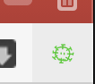
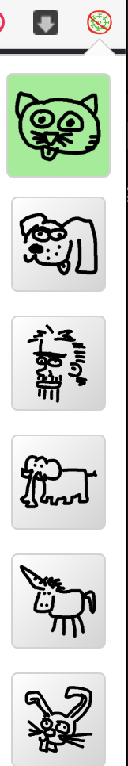

# DeCoronizer

DeCoronize is a Chromeplugin to Socially distances you from Chuck Norris virus and fix a Website.

## Why?

We don't know why.

If you see any point in this Plugin, please let us know.

## Download

(URL to PluginStore)

## Usage

After the installation you will have a new icon next to the address bar. 

By clicking on the icon you can choose the flavour (Kitty, Dogs, Chuck etc.) 

The Icon switch to a prohibitory sign to indicate
as of now (almost) all Websites are DeCoronized.

Confused? The Green sign indicate a inactive Plugin and the crossed sign an Active? Welcome to the World of DeCoronizer!

Anyway ... and now (almost) all websites will be Decoronized (unfortunately only in your browser). You are distanced from vitally important messages and a lot of information are distorted and wrong, just for you. The plugin can put your life in danger if you believe the information - is there really a Chuck Norrisvirus? Or is it a Bunnyvirus? Who knows?

_BUT_

If you are a sensitive person who suffers from bad news more than normal people, this extension will be your salvation.

_IS THIS ALL DAVE? NO JIM ...._

As a special bonus, Twitter becomes utterly useless for you. Just for this feature this plugin is worthwhile.

## deinstallation

- developermode on
- remove
- developermode off

## Contribute

We need your support! For example, we want to provide many more languages.
If you have time and energy, help us. Grab the content of one of the _locales folders and
go for it!

You're Coder? Very good. Please look at our code and improve it. Even small enhancements help a lot.

 - https://www.youtube.com/watch?v=6Kw12eGCtjY (draw-tipps für die icons)

## Credits

- Felix fel.batu@gmail.com
- Boris boris.baumann@gmail.com
- Phillipp Kasteck 
- marco Nittler

## License
GNU General Public License v3.0
